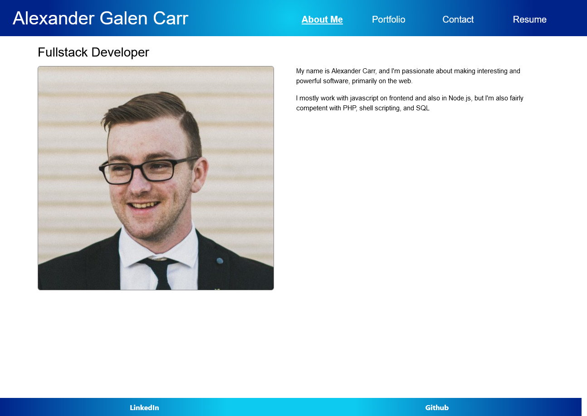

# Alexander Galen Carr's Personal Portfolio Website

This is just a simple front end only web app using react meant to show off the projects I've worked on, my resume, and also to field questions or comments from users.

It uses react router to manage the different pages being displayed, as well as displaying which page is currently being viewed in the nav.

[Deployed Application](https://alexandergalen.github.io/react-portfolio/)

